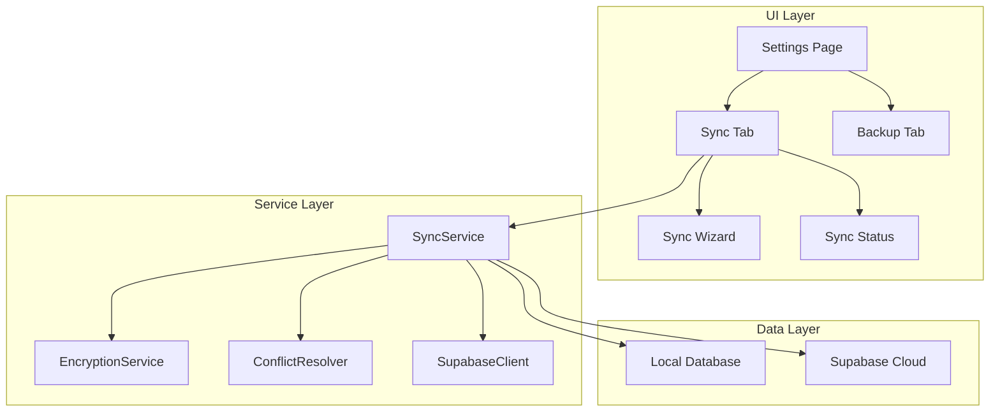
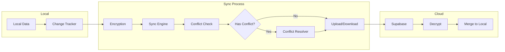

## Product Overview

为 Kelivo 应用实现基于 Supabase 的多端数据同步功能，支持用户在多个设备间安全同步应用数据。系统包含完整的同步引擎、端到端加密服务、冲突解决机制，以及重新设计的设置页面（通过 Tab 切换展示"数据同步"和"数据备份"功能）。

## Core Features

- **Supabase 同步引擎**：实现数据的增量同步、全量同步，支持离线操作和在线同步
- **端到端加密服务**：使用 AES-256 加密用户数据，确保云端数据安全
- **冲突解决机制**：自动检测数据冲突，提供智能合并和用户手动选择策略
- **UI 设置页面重构**：将原"数据备份"菜单改为"数据同步"，使用 Tab 切换展示"数据同步"和"数据备份"（原 WebDAV 备份）两个子页面
- **数据同步设置向导**：引导用户完成 Supabase 连接配置、加密密钥设置、同步偏好设置
- **Supabase 配置文档**：提供项目创建和 SQL 初始化指南

## Tech Stack

- **框架**：Flutter (Dart)
- **后端服务**：Supabase (PostgreSQL + Realtime + Auth)
- **加密库**：cryptography (Dart)
- **状态管理**：沿用项目现有方案
- **新增依赖**：
- supabase_flutter: Supabase Flutter SDK
- cryptography: 加密算法库
- shared_preferences: 本地配置存储（如已有则复用）

## Architecture Design

### System Architecture

采用分层架构设计，将同步功能模块化，便于维护和扩展。



### Module Division

| 模块 | 职责 | 关键技术 | 依赖 |
| --- | --- | --- | --- |
| SyncEngine | 同步逻辑核心，管理同步状态和流程 | supabase_flutter | EncryptionService, ConflictResolver |
| EncryptionService | 数据加密解密，密钥管理 | cryptography | - |
| ConflictResolver | 冲突检测与解决策略 | Dart | - |
| SyncSettingsUI | 同步设置界面和向导 | Flutter | SyncEngine |
| SupabaseConfig | Supabase 连接配置管理 | supabase_flutter | - |


### Data Flow



## Implementation Details

### Core Directory Structure

```
lib/
├── features/
│   ├── sync/
│   │   ├── data/
│   │   │   ├── models/
│   │   │   │   ├── sync_record.dart
│   │   │   │   └── sync_config.dart
│   │   │   ├── repositories/
│   │   │   │   └── sync_repository.dart
│   │   │   └── sources/
│   │   │       └── supabase_data_source.dart
│   │   ├── domain/
│   │   │   ├── services/
│   │   │   │   ├── sync_service.dart
│   │   │   │   ├── encryption_service.dart
│   │   │   │   └── conflict_resolver.dart
│   │   │   └── entities/
│   │   │       └── sync_state.dart
│   │   └── presentation/
│   │       ├── pages/
│   │       │   ├── data_sync_page.dart
│   │       │   └── sync_wizard_page.dart
│   │       ├── widgets/
│   │       │   ├── sync_status_card.dart
│   │       │   ├── sync_settings_form.dart
│   │       │   └── conflict_dialog.dart
│   │       └── controllers/
│   │           └── sync_controller.dart
│   └── backup/
│       └── pages/
│           └── backup_page.dart (existing, WebDAV backup)
├── desktop/
│   └── setting/
│       ├── data_management_pane.dart (new, Tab container)
│       └── backup_pane.dart (existing)
├── core/
│   └── supabase/
│       ├── supabase_client.dart
│       └── supabase_config.dart
└── docs/
    └── supabase_setup_guide.md
```

### Key Code Structures

```
// 同步配置模型
class SyncConfig {
  final String supabaseUrl;
  final String supabaseAnonKey;
  final String? encryptionKey;
  final bool autoSync;
  final int syncIntervalMinutes;
  final ConflictStrategy conflictStrategy;
}

// 同步状态
enum SyncStatus { idle, syncing, success, error, conflict }

// 同步服务接口
abstract class SyncService {
  Future<void> initialize(SyncConfig config);
  Future<SyncResult> syncNow();
  Stream<SyncStatus> get statusStream;
  Future<void> resolveConflict(ConflictResolution resolution);
}

// 加密服务接口
abstract class EncryptionService {
  Future<String> encrypt(String plainText, String key);
  Future<String> decrypt(String cipherText, String key);
  String generateKey();
}

// 冲突解决策略
enum ConflictStrategy {
  keepLocal,      // 保留本地
  keepRemote,     // 保留远程
  keepNewest,     // 保留最新
  manual          // 手动选择
}
```

### Supabase 数据表设计

```sql
-- 用户同步数据表
CREATE TABLE sync_data (
  id UUID PRIMARY KEY DEFAULT gen_random_uuid(),
  user_id UUID REFERENCES auth.users(id),
  data_type VARCHAR(50) NOT NULL,
  data_id VARCHAR(100) NOT NULL,
  encrypted_content TEXT NOT NULL,
  version INTEGER DEFAULT 1,
  updated_at TIMESTAMP WITH TIME ZONE DEFAULT NOW(),
  created_at TIMESTAMP WITH TIME ZONE DEFAULT NOW(),
  UNIQUE(user_id, data_type, data_id)
);

-- 同步元数据表
CREATE TABLE sync_metadata (
  id UUID PRIMARY KEY DEFAULT gen_random_uuid(),
  user_id UUID REFERENCES auth.users(id) UNIQUE,
  last_sync_at TIMESTAMP WITH TIME ZONE,
  device_id VARCHAR(100),
  sync_version INTEGER DEFAULT 0
);

-- RLS 策略
ALTER TABLE sync_data ENABLE ROW LEVEL SECURITY;
ALTER TABLE sync_metadata ENABLE ROW LEVEL SECURITY;

CREATE POLICY "Users can only access own data" ON sync_data
  FOR ALL USING (auth.uid() = user_id);

CREATE POLICY "Users can only access own metadata" ON sync_metadata
  FOR ALL USING (auth.uid() = user_id);
```

## Technical Considerations

### Security

- 使用 AES-256-GCM 进行端到端加密
- 加密密钥由用户设置，不上传至服务器
- Supabase RLS 确保用户只能访问自己的数据

### Performance

- 增量同步减少数据传输量
- 本地缓存同步状态避免重复请求
- 后台静默同步不阻塞 UI

### Offline Support

- 离线时记录变更队列
- 网络恢复后自动同步
- 冲突检测基于版本号和时间戳

## Agent Extensions

### SubAgent

- **code-explorer**
- Purpose: 探索现有项目结构，了解备份页面、设置页面的具体实现细节，以及现有的状态管理和数据层架构
- Expected outcome: 获取完整的代码上下文，确保新功能与现有代码风格和架构保持一致